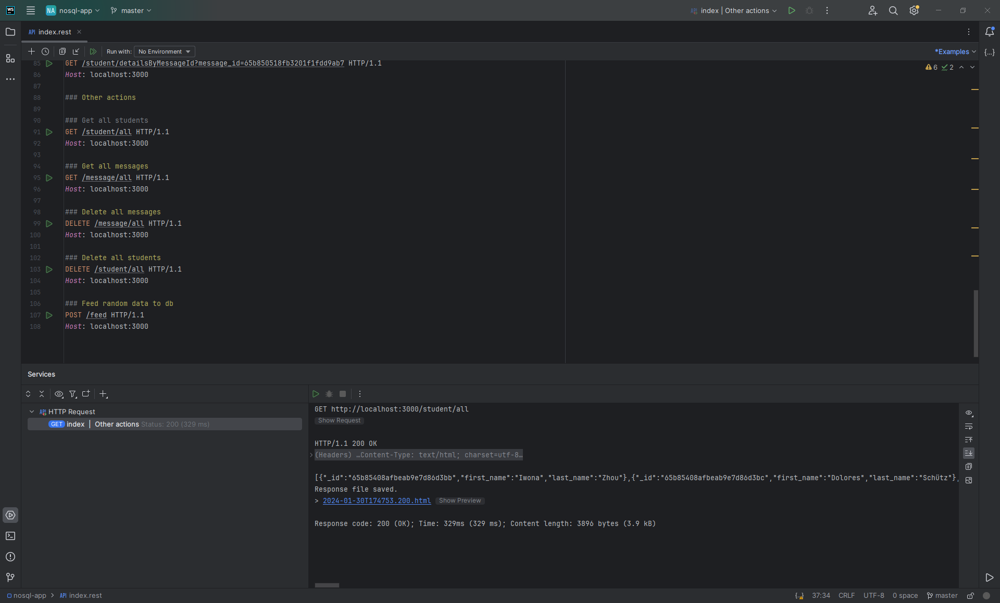
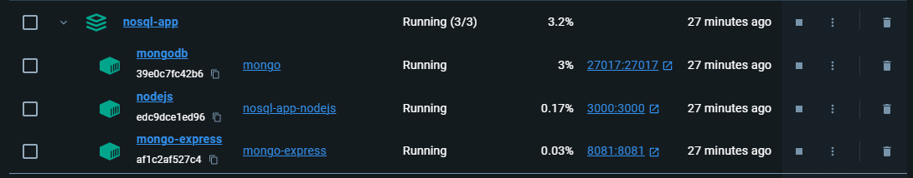
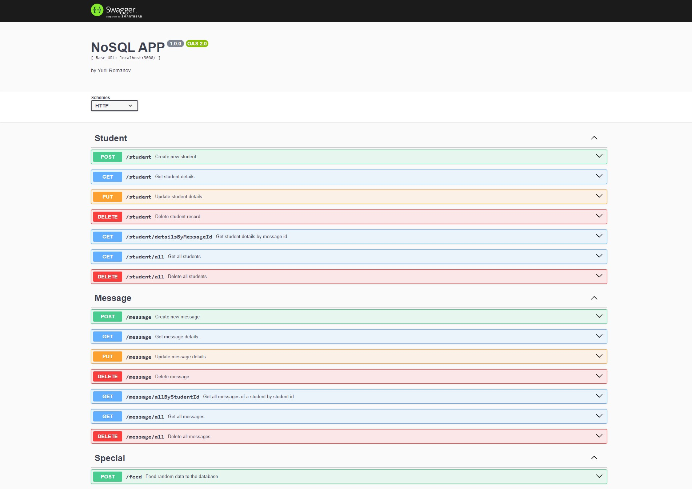
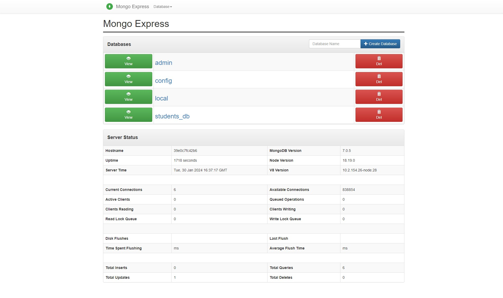
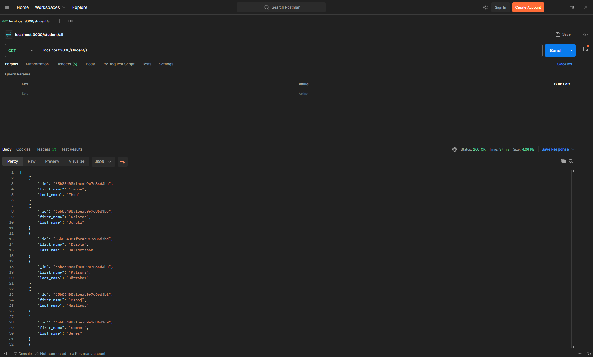

# Podstawy baz danych typu No SQL

### Yurii Romanov, 159460

## Sprawozdanie z projektu

#### Wstęp

Zgodnie z zadaniem, projekt ten przygotowuje aplikację serwerową, która służy jako 
API dla fikcyjnej aplikacji, która może być używana do zarządzania 
uczniami i ich wiadomościami wysyłanymi do nauczyciela.

#### Używane narzędzia i technologie

- `MongoDB` - baza danych `NoSQL`
- `NodeJS` - środowisko wykonawcze JavaScript
- `ExpressJS` - framework `NodeJS`'owy dla budowania aplikacji webowych 
- `MongoExpress` - proste wizualne rozszerzenie dla sterowania bazą danych `Mongo` 
- `Docker` - konteneryzowane środowisko deweloperskie
- `Swagger` - narzędzie dla wizualizacji udostępnionych przez aplikację endpoint'ów
- `Postman` - narzędzie dla kierowania zapytań do API


#### Instrukcje użytkowania

Przede wszystkim, należy upewnić się, że na komputerze jest zainstalowany Docker i przeglądarka.

Dalej, dla zapewnienia poprawnego działania aplikacji, trzeba w folderze z kodem żródlowym stworzyć
i wypełnić plik `.env`. Aby ułatwićten proces, przygotowałem przykładowy plik `.env.example`, który 
wystarczy przemianować na `.env` i ten krok zostanie wykonany.

Pod warunkiem, że NodeJS i npm (lub yarn) są zainstalowane na komputerze, 
należy uruchomić następujące polecenie: 
```bash
yarn docker:build-and-up
```
Gdyż nie ma na komputerze zainstalowanego Node'a, wystarczy odpalić nastepujące polecenia:
```bash
docker build .
```
```bash
docker compose up
```

Po odpaleniu tych poleceń, zacznie się budowanie i praca środowiska. 

Gdy w konsoli wyświetli się następujaca wiadomość, znaczy to, że z API już można korzystać.
```
nodejs         | ↓↓↓↓↓↓↓↓↓↓↓↓↓↓↓↓↓↓↓↓
nodejs         | 
nodejs         | 
nodejs         | Connected to MongoDB
nodejs         | 
nodejs         | 
nodejs         | ↑↑↑↑↑↑↑↑↑↑↑↑↑↑↑↑↑↑↑↑
```

Po uruchomieniu aplikacji, API będzie dostępne pod portem 3000 (lub innym, wskazanym w pliku `.env`).

---

Mimo że da się korzystać z aplikacji, jak ze zwykłego serwera, czyli po prostu 
przesyłając do niego zapytania, przygotowałem także interfejs graficzny dla sterowania 
zapytaniami za pomocą `Swagger'a`.

Żeby odpalić interfejs graficzny, należy otworzyć w przeglądarce ten link:
http://localhost:3000/api/

Jako że ta aplikacja nie jest obecnie bardzo zaawansowana (np. nie ma autoryzacji/autentykacji),
korzystanie z interfejsu `Swagger'a` nie powinno być zbyt trudne.
Na wszelki przypadek zostawiam wspomagający link niżej.
https://idratherbewriting.com/learnapidoc/pubapis_swagger.html#make-a-request

---

Drugim przydatnym serwisem, który wbudowałem w aplikację, jest `mongo-express`, który 
spełnia funkcję GUI dla bazy danych `Mongo`. Za pomocą tego serwisu jest łatwiej sprawdzić, 
czy zmiany po "strzału" do API zapisały się poprawnie. Port do tego serwisu można zmienić w 
pliku `.env`, zmieniając znaczenie zmiennej `MONGO_EXPRESS_PORT`.

Odpalenie `mongo-expres` nie jest szybkim procesem, więc na niego trzeba trochę poczekać.
Serwis `mongo-express` staje się dostępny, gdy w konsoli zjawi się kolejny komunikat:
```
mongo-express  | Mongo Express server listening at http://0.0.0.0:8081
mongo-express  | Server is open to allow connections from anyone (0.0.0.0)
mongo-express  | basicAuth credentials are "admin:pass", it is recommended you change this in your config.j
s!
```

Link do `mongo-express`: http://localhost:8081/

---

Początkowo, aplikacja nie zawiera żadnych wpisów w bazie danych. Dlatego, wraz ze zrzutem 
lokalnej bazy danych, przygotowałem endpoint, który wypełnia bazę sztucznymi danymi, 
wygenerowanymi losowo.
Aby wykonać tę akcję, trzeba wysłać zapytanie metodą `POST` do ścieżki `/feed`.
Najłatwiej to zrobić za pomocą `Swagger`'a.

---

Przygotowałem również plik `index.rest`, który zawiera wszystkie dostępne ścieżki. 
Niektóre IDE (np. WebStorm) są wyposażone w rozszerzenia, pozwalające na wygodne korzystanie z 
tych ścieżek. Ale nadał uważam, że `Swagger` jest wygodniejszy.



---

#### Zrzuty z ekranu

- Działające kontenery w Docker'ze



- Interfejs `Swagger`



- Interfejs `mongo-express`



- Korzystanie z aplikacji za pomocą `Postman`'a



---

### Wnioski

Szczerze mówiąc, ten kurs był dla mnie zarówno najłatwiejszy, jak i najciekawszy z pozostałych w tym semestrze. Dlaczego? Ponieważ jest to prawie jedyny kurs, który bezpośrednio uczy praktycznych umiejętności w zakresie nowoczesnych technologii tworzenia aplikacji internetowych. Dla mnie osobiście bardzo interesujące i przydatne było zrozumienie nie tyle baz danych NoSQL, co Dockera i jego zasad.

Co więcej, ten kurs był dla mnie przydatny, ponieważ reprezentuje pracę po lustrzanej stronie mojej kariery zawodowej - w normalnym życiu pracuję jako programista frontendowy, koncentrując się głównie na wizualnym komponencie aplikacji, a rozwijając ten projekt rozwinąłem umiejętności w zakresie programowania po stronie serwera.

Jest to rzadki przypadek, kiedy jestem naprawdę gotowy napisać "Podobała mi się praca nad tym zadaniem i wiele się w tym czasie nauczyłem".